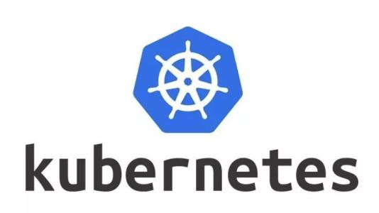

# Kubernetes Operator

  * Operator 是由 CoreOS 开发的，用来扩展 Kubernetes API，特定的应用程序控制器，它用来创建、配置和管理复杂的有状态应用，如数据库、缓存和监控系统。Operator 基于 Kubernetes 的资源和控制器概念之上构建，但同时又包含了应用程序特定的领域知识。创建Operator 的关键是CRD（自定义资源）的设计。 
  * Kubernetes 1.7 版本以来就引入了自定义控制器的概念，该功能可以让开发人员扩展添加新功能，更新现有的功能，并且可以自动执行一些管理任务，这些自定义的控制器就像 Kubernetes 原生的组件一样，Operator 直接使用 Kubernetes API进行开发，也就是说他们可以根据这些控制器内部编写的自定义规则来监控集群、更改 Pods/Services、对正在运行的应用进行扩缩容。

前提条件:

* Kubernetes 1.7 版本
* Operator-sdk version: v0.7.0（这里有最新版就安装最新版的吧）
* go version go1.11.4 darwin/amd64

主要功能

Operator SDK 提供以下工作流来开发一个新的 Operator：

使用 SDK 创建一个新的 Operator 项目
通过添加自定义资源（CRD）定义新的资源 API
指定使用 SDK API 来 watch 的资源
定义 Operator 的协调（reconcile）逻辑
使用 Operator SDK 构建并生成 Operator 部署清单文件


#### quick start

##### 安装 operator-sdk
operator sdk 安装方法非常多，我们可以直接在 github 上面下载需要使用的版本，然后放置到 PATH 环境下面即可，当然也可以将源码 clone 到本地手动编译安装即可，如果你是 Mac，当然还可以使用常用的 brew 工具进行安装：
我使用brew 安装的版本是`v0.16.0`

```bash
$ brew install operator-sdk

➜  tiger git:(master) ✗ operator-sdk version
operator-sdk version: "v0.16.0", commit: "55f1446c5f472e7d8e308dcdf36d0d7fc44fc4fd", go version: "go1.14 darwin/amd64"
    
```

##### 创建项目

添加一个项目名称为operator 的项目

```bash
operator-sdk new operator
```

#### 添加 API

现在我需要添加一个AppService 的crd资源

kubectl apply -f crd.yml

```yaml
apiVersion: app.example.com/v1
kind: AppService
metadata:
  name: nginx-app
spec:
  size: 2
  image: nginx:1.7.9
  ports:
    - port: 80
      targetPort: 80
      nodePort: 30002
```

在为该资源创建api

```bash
$ operator-sdk add api --api-version=app.example.com/v1 --kind=AppService
```

打开源文件pkg/apis/app/v1/appservice_types.go，
需要我们根据我们的需求去自定义结构体 AppServiceSpec，我们最上面预定义的crd yaml中的属性，所有我们需要用到的属性都需要在这个结构体中进行定义：


```go
// AppServiceSpec defines the desired state of AppService
type AppServiceSpec struct {
	// INSERT ADDITIONAL SPEC FIELDS - desired state of cluster
	// Important: Run "operator-sdk generate k8s" to regenerate code after modifying this file
	// Add custom validation using kubebuilder tags: https://book-v1.book.kubebuilder.io/beyond_basics/generating_crd.html
	Size      *int32 `json:"size"`
	Image     string `json:"image"`
	Resources string `json:"resources,omitempty"`
	Envs      string `json:"envs,omitempty"`
	Ports     string `json:"ports,omitempty"`
}
```

然后一个比较重要的结构体AppServiceStatus用来描述资源的状态，当然我们可以根据需要去自定义状态的描述，我这里就随便定义一下：

```go

// AppServiceStatus defines the observed state of AppService
type AppServiceStatus struct {
	// INSERT ADDITIONAL STATUS FIELD - define observed state of cluster
	// Important: Run "operator-sdk generate k8s" to regenerate code after modifying this file
	// Add custom validation using kubebuilder tags: https://book-v1.book.kubebuilder.io/beyond_basics/generating_crd.html
	Status int `json:"status"`
}
```

上面我们添加自定义的 API，接下来可以添加对应的自定义 API 的具体实现 Controller，同样在项目根目录下面执行如下命令：

```bash
$ operator-sdk add controller --api-version=app.example.com/v1 --kind=AppService
```


定义完成后，在项目根目录下面执行如下命令：

```bash
$ operator-sdk generate k8s

```

该命令是用来根据我们自定义的 API 描述来自动生成一些代码，目录pkg/apis/app/v1/下面以zz_generated开头的文件就是自动生成的代码，里面的内容并不需要我们去手动编写。

这样我们就算完成了对自定义资源对象的 API 的声明。

自定义的资源对象现在测试通过了，但是如果我们将本地的operator-sdk up local命令终止掉，我们可以猜想到就没办法处理 AppService 资源对象的一些操作了，所以我们需要将我们的业务逻辑实现部署到集群中去。

执行下面的命令构建 Operator 应用打包成 Docker 镜像：

```bash
operator-sdk build cnych/opdemo
INFO[0002] Building Docker image cnych/opdemo
Sending build context to Docker daemon  400.7MB
Step 1/7 : FROM registry.access.redhat.com/ubi7-dev-preview/ubi-minimal:7.6
......
Successfully built a8cde91be6ab
Successfully tagged cnych/opdemo:latest
INFO[0053] Operator build complete.

```

运行：

```yaml
$ docker run -e WATCH_NAMESPACE=kube-system  cnych/opdemo:latest
```

```log
{"level":"info","ts":1586607749.180708,"logger":"cmd","msg":"Operator Version: 0.0.1"}
{"level":"info","ts":1586607749.1809702,"logger":"cmd","msg":"Go Version: go1.14"}
{"level":"info","ts":1586607749.1810098,"logger":"cmd","msg":"Go OS/Arch: linux/amd64"}
{"level":"info","ts":1586607749.1810224,"logger":"cmd","msg":"Version of operator-sdk: v0.16.0"}
{"level":"error","ts":1586607749.182614,"logger":"cmd","msg":"","error":"could not locate a kubeconfig","stacktrace":"github.com/go-logr/zapr.(*zapLogger).Error\n\t/Users/clare/go/pkg/mod/github.com/go-logr/zapr@v0.1.1/zapr.go:128\nmain.main\n\toperator/cmd/manager/main.go:83\nruntime.main\n\t/usr/local/go/src/runtime/proc.go:203"}
```

接下来我们需要创建crd 资源

```yaml
apiVersion: apiextensions.k8s.io/v1beta1
kind: CustomResourceDefinition
metadata:
  name: appversion.example.com
spec:
  group: example.com
  version: v1
  names:
    kind: Appversion
    plural: appversions
  scope: Namespaced
```